# AWS Lambda

## Sleep tasks with cold starts (256 MB)

  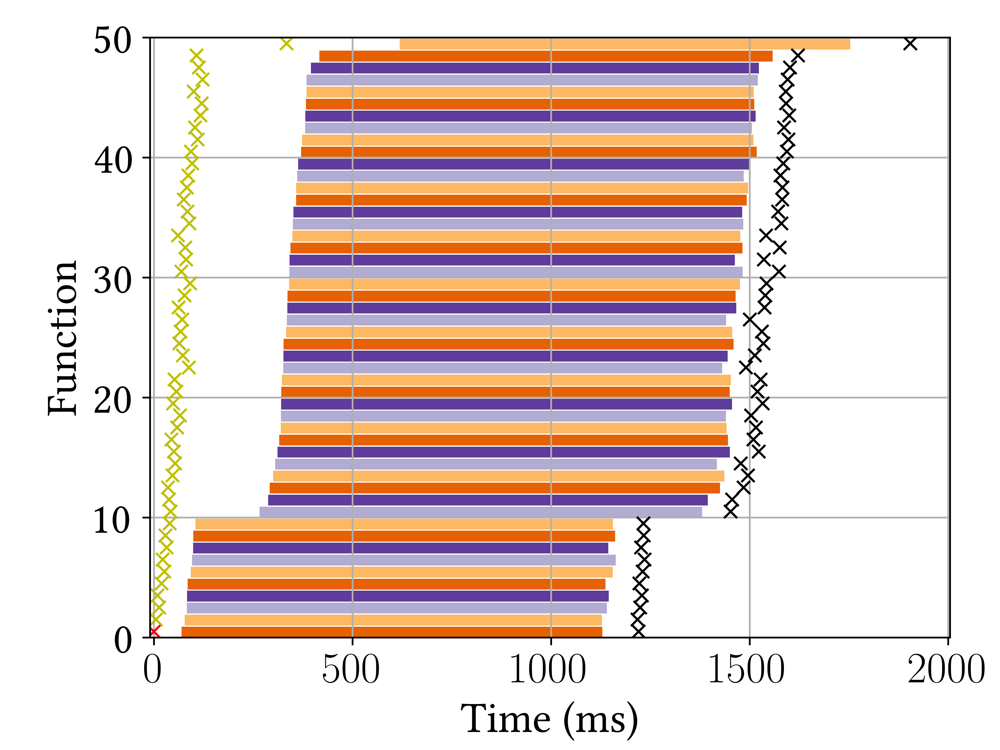</img>
  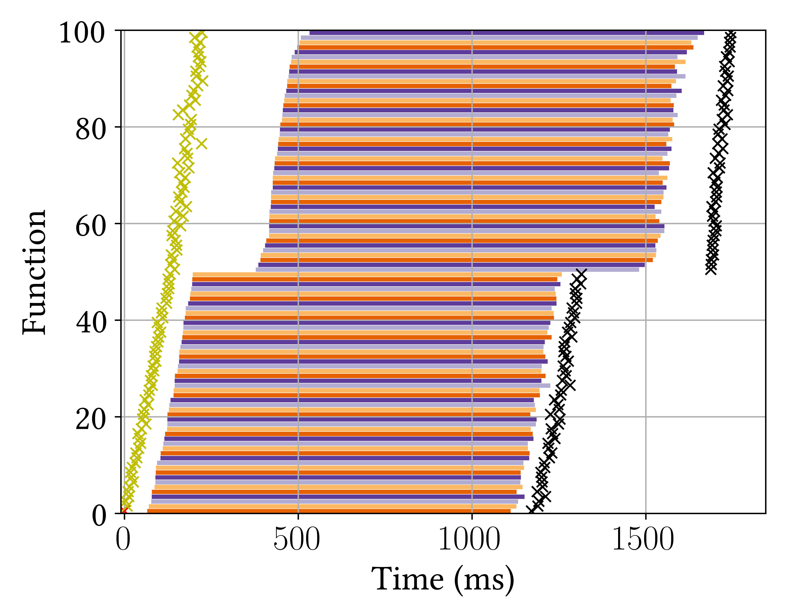</img>
  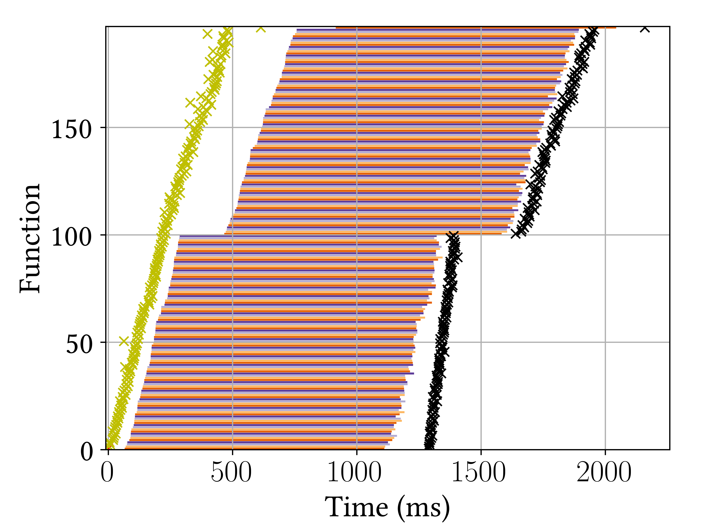</img>

## Sleep tasks with warm instances (256 MB)

  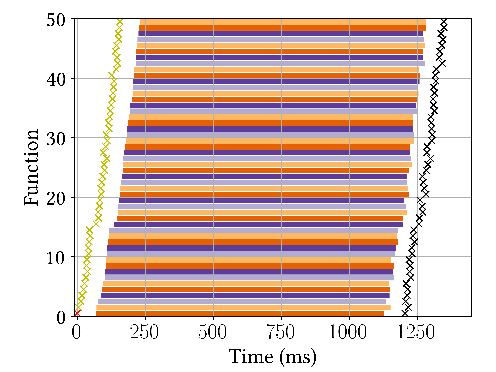</img>
  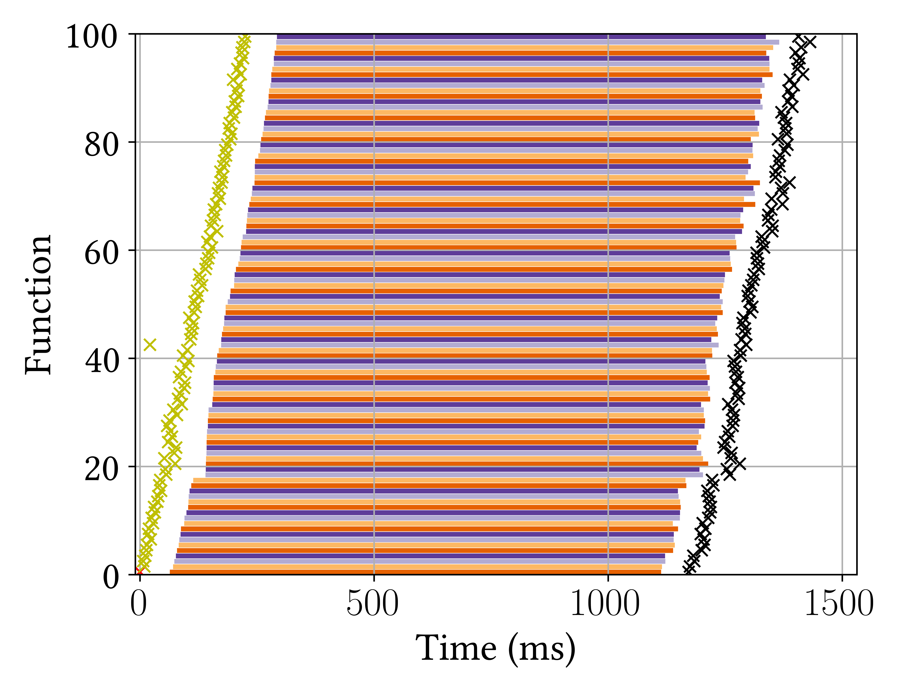</img>
  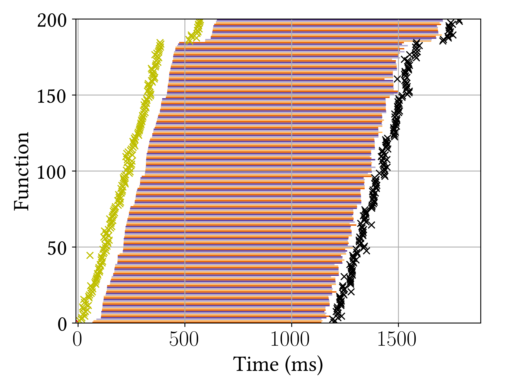</img>

## Compute tasks (256 MB)

  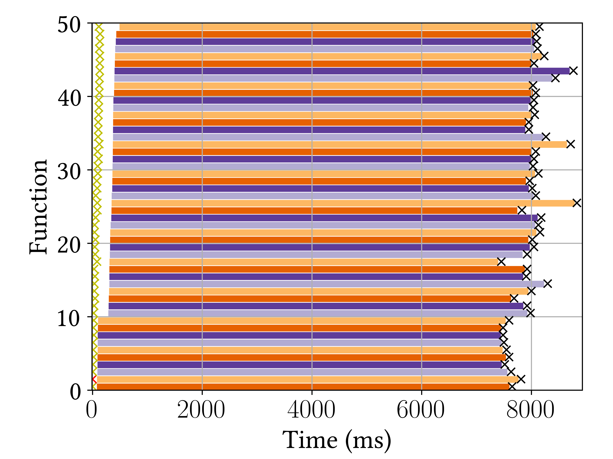</img>
  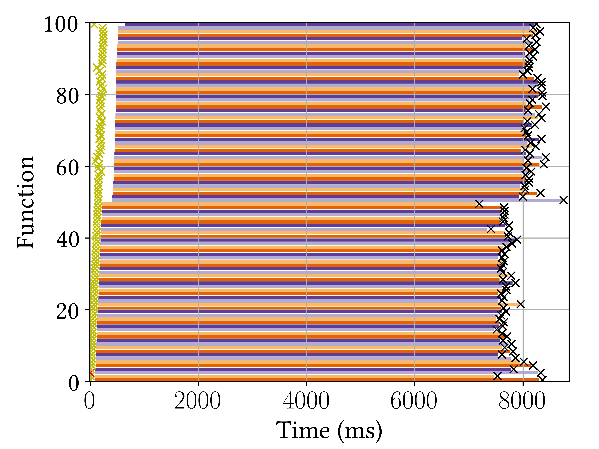</img>
  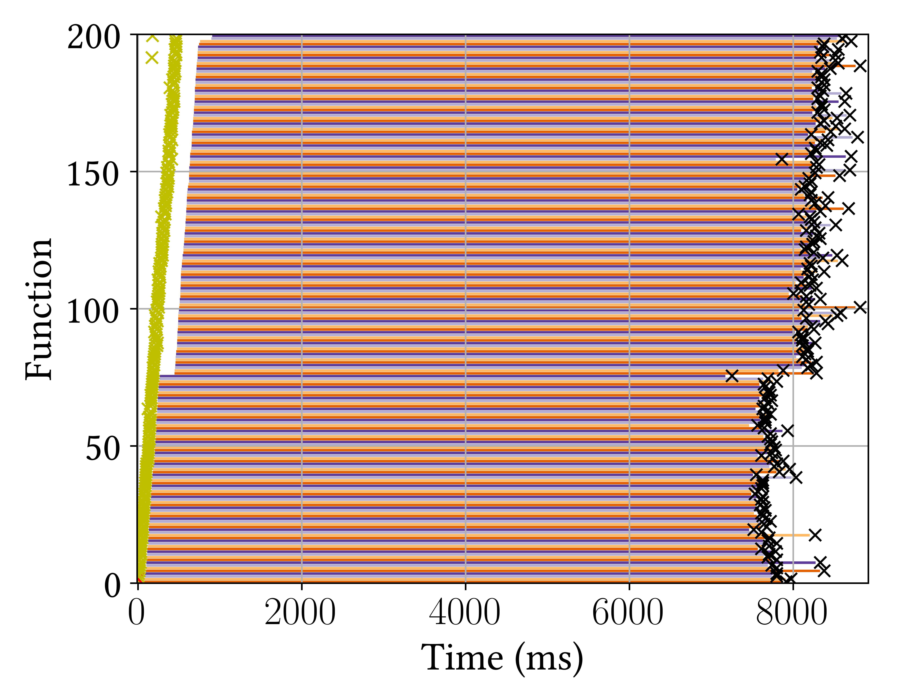</img>

## Compute tasks (2048 MB)

  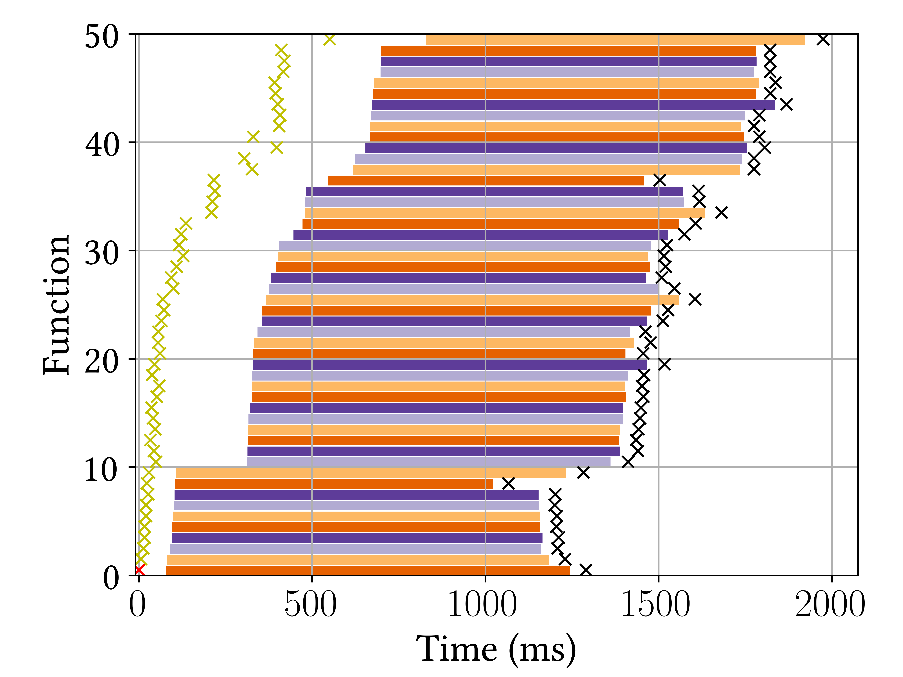</img>
  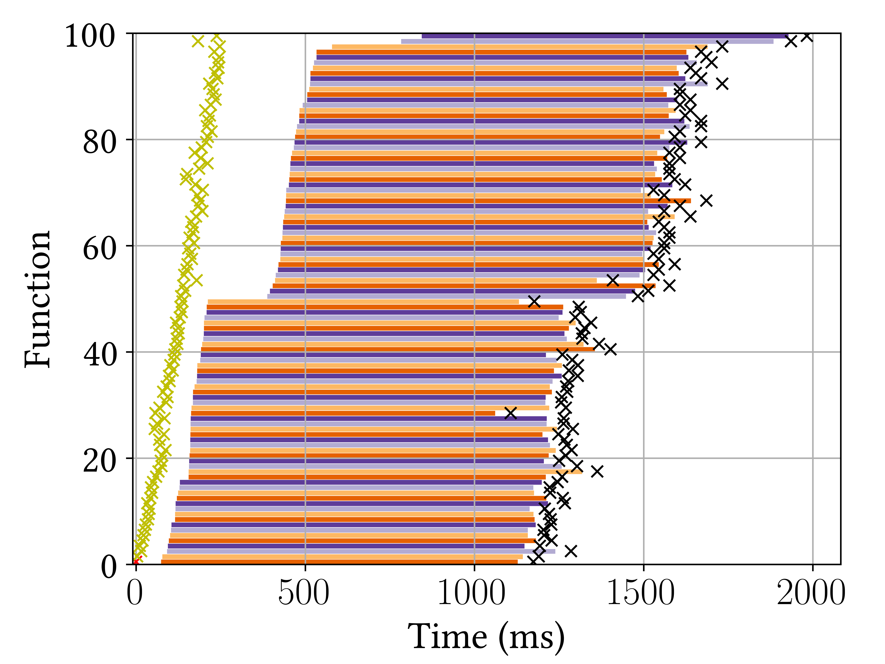</img>
  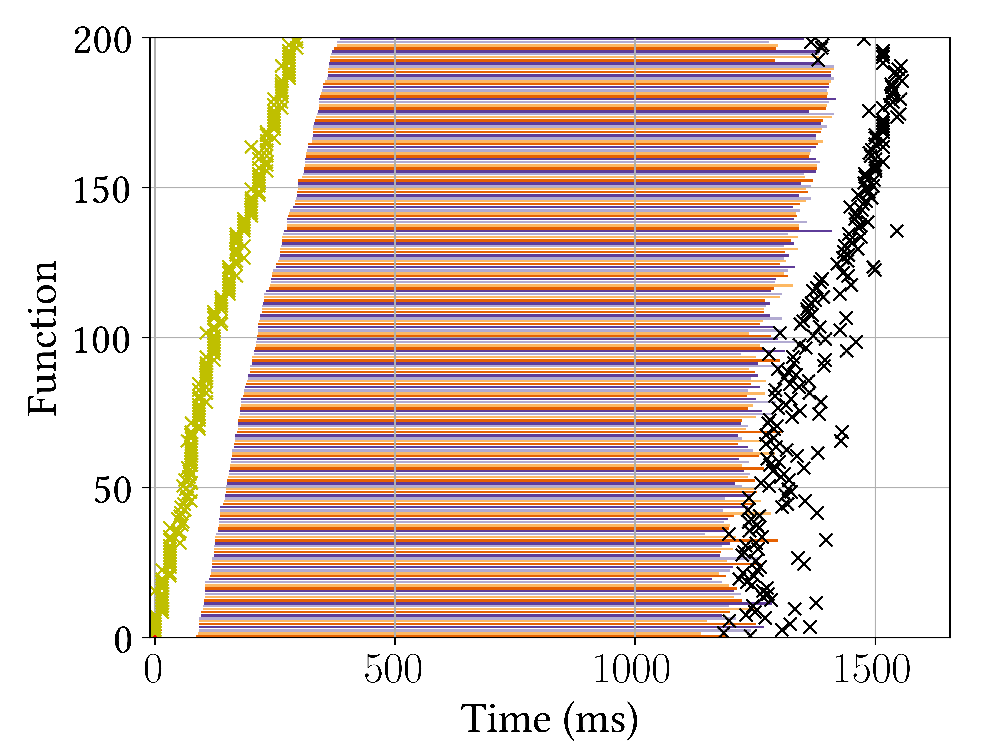</img>

Note: Some invocations hit cold starts. They are clearly noticeable by the increased delay.