# Azure Functions

## Sleep tasks

  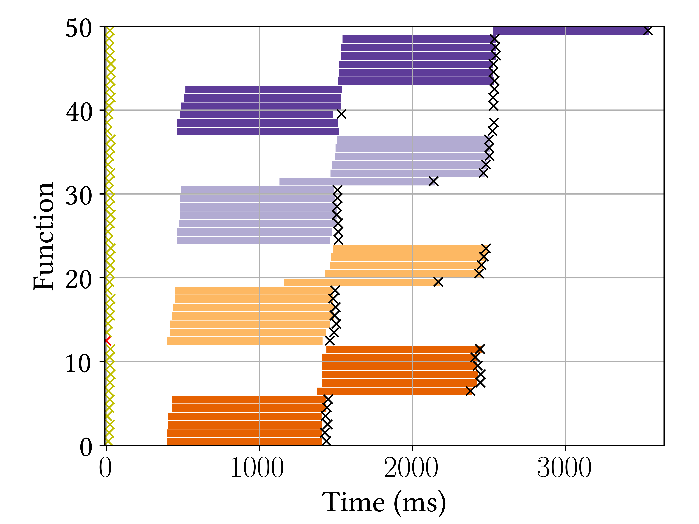</img>
  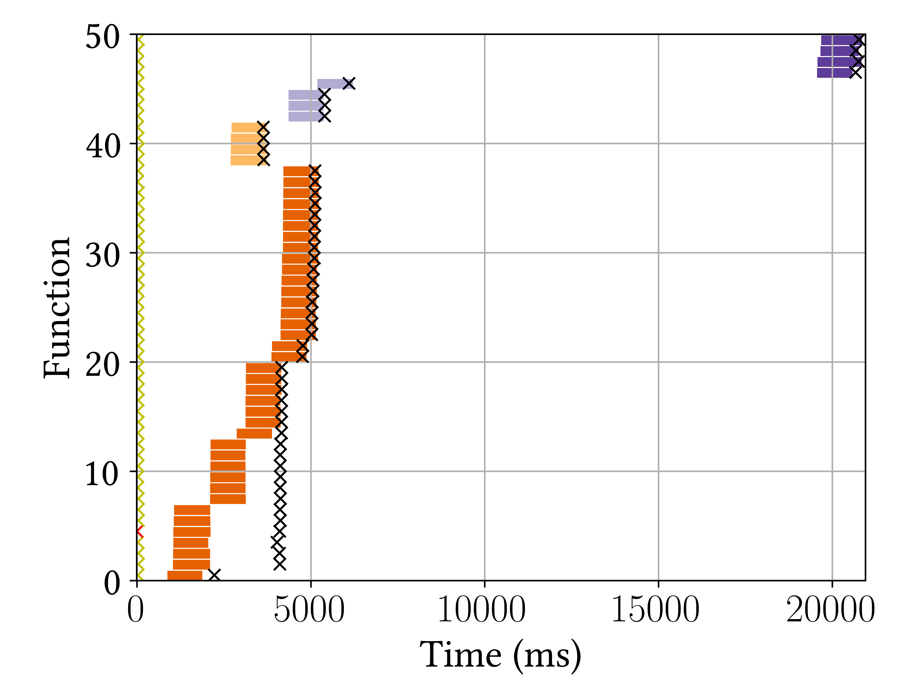</img>
  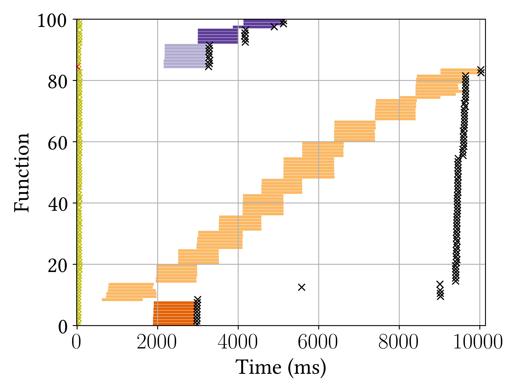</img>
  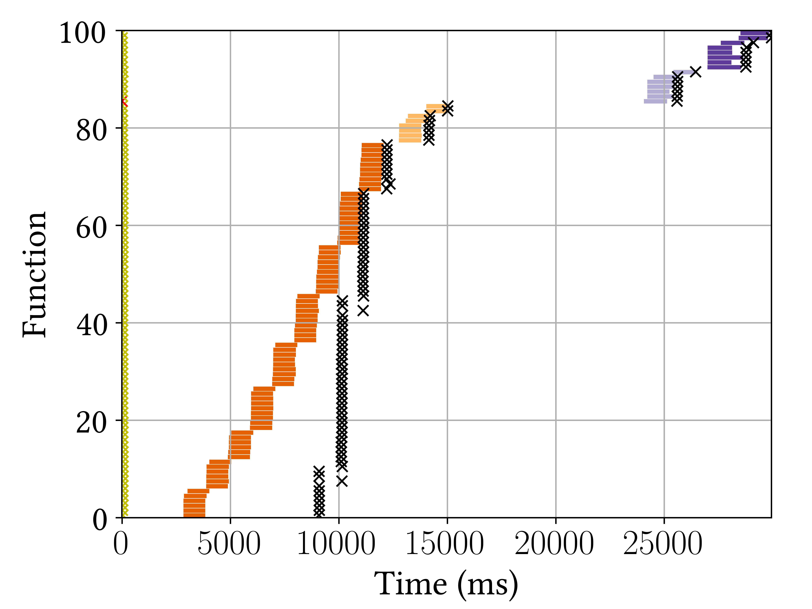</img>

## Compute tasks

  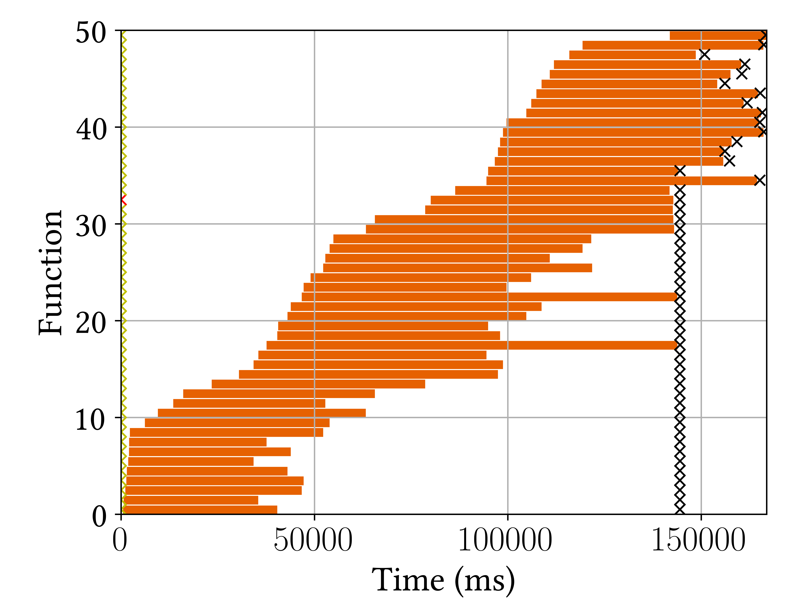</img>
  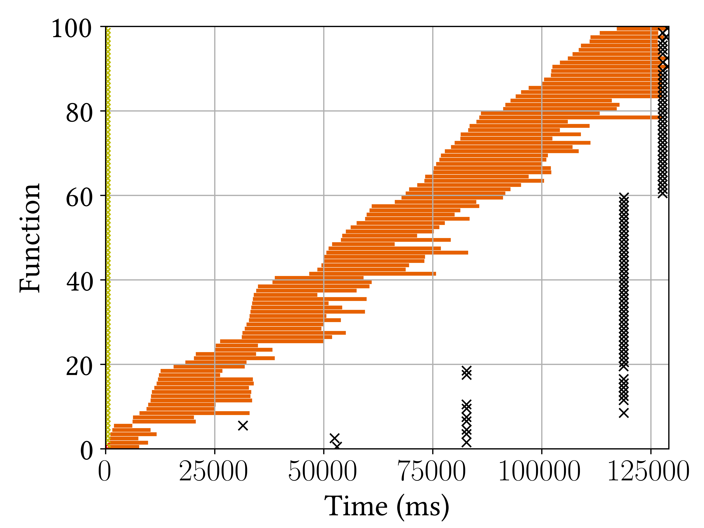</img>
  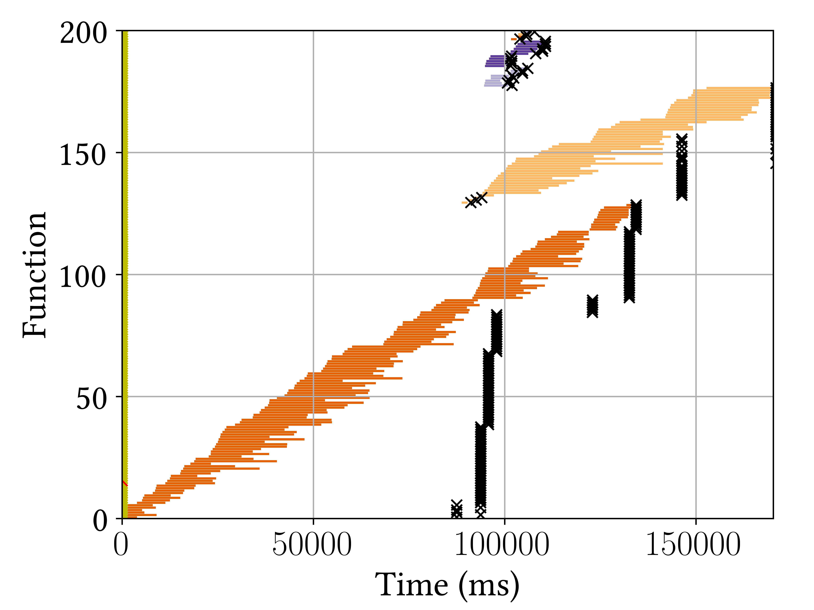</img>
  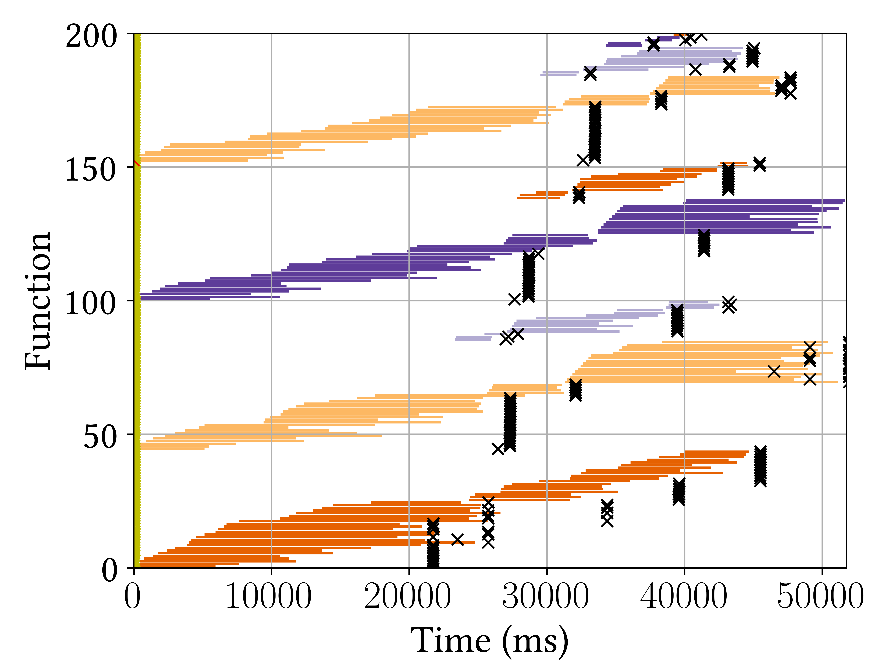</img>

## Compute tasks (with per instance limit)

  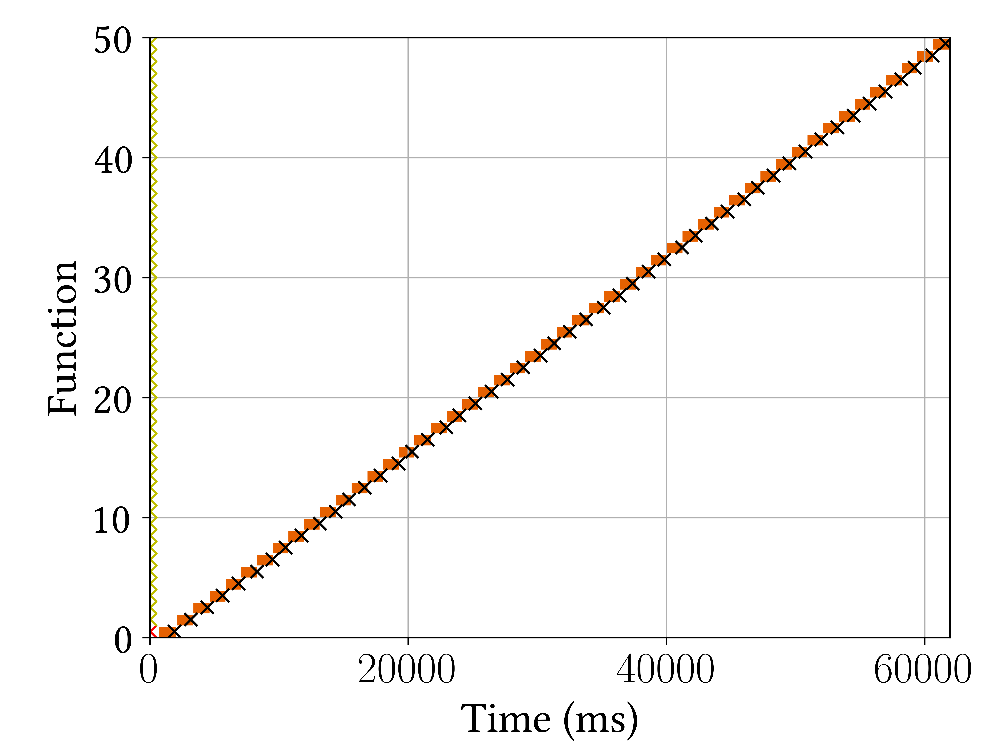</img>
  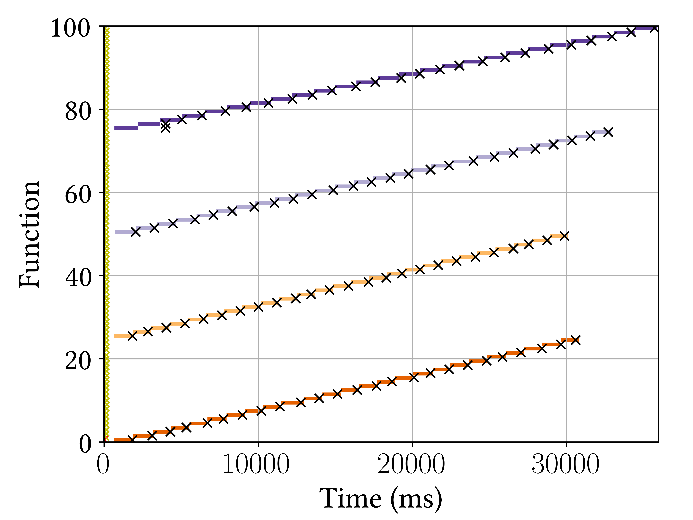</img>
  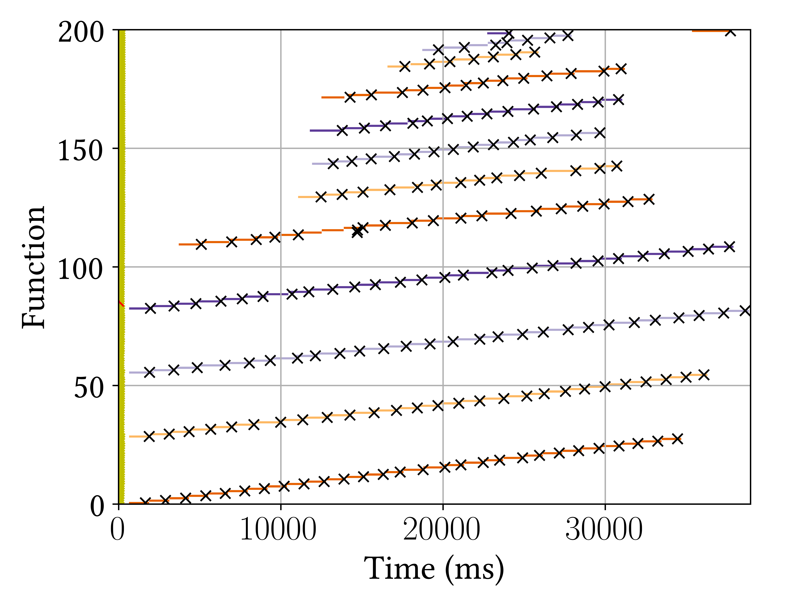</img>
  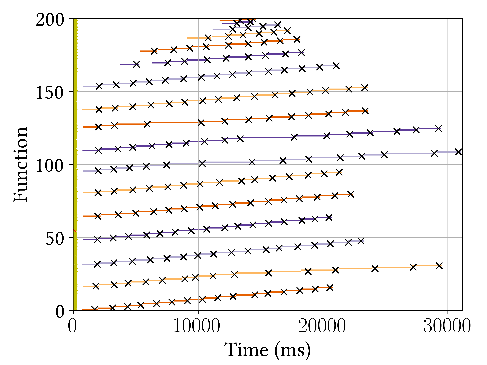</img>

